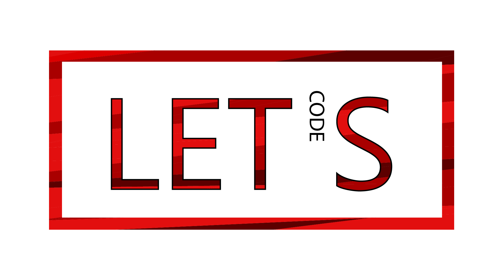

## letscode - interactive coding platform

**letscode** is an open source web-based, interactive coding platform for university students.
We believe, daily training and improving of coding skills is necessary for a better understanding of theoretical concepts.

Students may use the **letscode** platform by enrolling into courses and solving tasks.

Moderators and Administrators have additional features, including Course Management or User Management.

**Please note:** This project is work in progress and absolutely far away from beeing ready for production use!

### Constributions

The **letscode** platform is actively maintained and developed by OpenDevSpace,
a student group creating open source applications at Ruhr West University of Applied Sciences.
We are always looking for people and groups, who want to join us or support our development.

You are an individual person? We appreciate your issues with feature requests or bugs and your pull requests.
Located near Bottrop, Germany? Come along to one of our meetings :)

Working on a similar solution with your group? Drop us a line and tell us! We are happy to hear from you!

Your contact persons: 
Nicolas Stuhlfauth (<a href="https://github.com/nicostuhlfauth" target="_blank">GitHub</a> | <a href="https://twitter.com/nicostuhlfauth" target="_blank">Twitter</a>) 
Benedikt Rauch (<a href="https://github.com/benediktrauch" target="_blank">GitHub</a> | <a href="https://twitter.com/pingubene" target="_blank">Twitter</a>)

or simply email us: hello(at)opendev(dot)space